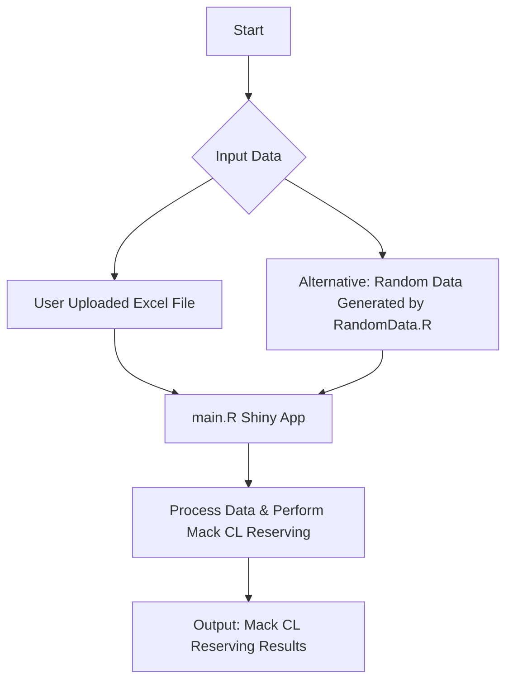

# Stochastic Actuarial Reserving App: Mack Chain Ladder Method

A short and sweet R Shiny application designed to empower actuaries, analysts, and insurance professionals to perform stochastic claims reserving using the well-established Mack Chain Ladder method.

This application provides a user-friendly interface to:

* Upload and validate your claims data effortlessly.
* Construct both incremental and cumulative claims development triangles.
* Apply the Mack Chain Ladder method to estimate reserves.
* Generate reserve estimates along with valuable uncertainty measures.
* Visualize key diagnostic plots to understand your data and results.
* Download all generated results in a convenient Excel-friendly format for further analysis.

## Required R Packages

To run this application, you need to install the following R packages. You can install them using the following code in your R console:

```R
install.packages(c(
  "shiny",
  "readxl",
  "dplyr",
  "lubridate",
  "tidyr",
  "ChainLadder",
  "DT",
  "writexl",
  "ggplot2",
  "patchwork"
))
```


